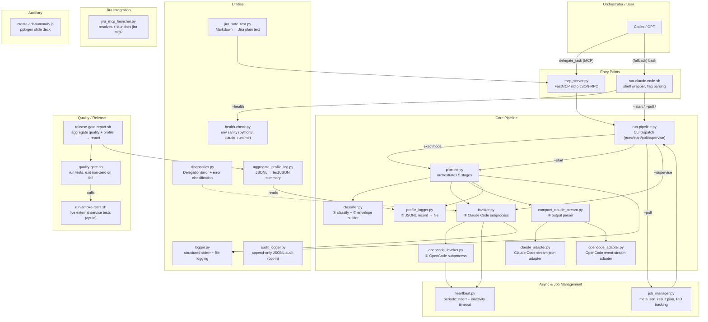

# Scripts Architecture Report

**Package:** claude-code-delegate v1.7.0  
**Purpose:** Delegate orchestrator-authored implementation plans to Claude Code or OpenCode  
**Generated:** 2026-05-20  

---

## Executive Summary

The `scripts/` directory contains 25 files (20 `.py`, 4 `.sh`, 1 `.js`) that implement a **delegation pipeline**: classify a task, wrap it in a prompt envelope, invoke an executor backend (Claude Code or OpenCode), compact the output into a structured report, and log a profile record. Two transports share this pipeline: a **MCP server** (stdio JSON-RPC, preferred) and a **shell wrapper** (CLI fallback). An **async job manager** with single-flight lease semantics handles long-running delegations. A set of **quality/release gate scripts** and **diagnostics/health-check** utilities complete the surface.

---

## Architecture Plot



---

## Module Inventory

Every file in `scripts/` with its role, caller, and connections.

| # | Script | Type | Role | Called By | Calls / Imports |
|---|--------|------|------|-----------|-----------------|
| 1 | `pipeline.py` | .py | **Orchestrator** — 5-stage delegation pipeline (classify, envelope, invoke, compact, profile). Also provides `start_delegation_async` (lease-guarded launch) and `poll_delegation_status`. | `mcp_server.py` (runtime), `run-pipeline.py` (CLI) | `classifier`, `invoker`, `job_manager`, `logger`, `profile_logger`, `compact_claude_stream` |
| 2 | `run-pipeline.py` | .py | **CLI dispatch** — parses argv into exec/start/poll/supervise modes, calls pipeline, prints compact report | `run-claude-code.sh` (shell wrapper) | `pipeline` (exec/start/poll), `invoker` (supervise) |
| 3 | `run-claude-code.sh` | .sh | **Shell wrapper** — bash flag parser (--pro/--flash/--opencode/--effort/--mcp etc.). Validates flags, then exec's `run-pipeline.py` | Orchestrator (human or Codex) | `run-pipeline.py`, `health-check.py` (--health) |
| 4 | `mcp_server.py` | .py | **MCP server** — FastMCP stdio JSON-RPC. Exposes 4 tools: `classify_task`, `delegate_task`, `aggregate_profile`, `format_jira_text`. Hot-reloads pipeline modules on each call. | MCP host (orchestrator) via `.mcp.json` | `pipeline`, `classifier`, `aggregate_profile_log`, `jira_safe_text` |
| 5 | `classifier.py` | .py | **Classifier + Envelope builder** — keyword-matches prompt to task type (jira_operation, code_edit, architecture_review, read_only_scan, unknown). Returns `Classification` dataclass + builds prepared prompt with Karpathy guidelines. | `pipeline.py`, `mcp_server.py` | *stdlib only* |
| 6 | `invoker.py` | .py | **Claude Code invoker** — builds `claude -p` subprocess with flags (model, effort, permission, MCP, output format). Manages child env, isolated Claude config, temp MCP config files. Provides `invoke_claude`, `launch_claude_async`, `supervise_job`. | `pipeline.py` | `logger`, `heartbeat`, `opencode_invoker` (delegates if executor=opencode), `job_manager` |
| 7 | `opencode_invoker.py` | .py | **OpenCode invoker** — builds `opencode run` subprocess with model mapping from Claude Code IDs to OpenCode provider/model format. Manages MCP env via `OPENCODE_CONFIG_CONTENT`. | `invoker.py` (routed from `invoke_claude`) | `logger`, `heartbeat`, `invoker` (resolve MCP path) |
| 8 | `compact_claude_stream.py` | .py | **Output compactor** — detects backend format (Claude Code stream-json vs OpenCode event stream), delegates to per-backend adapter, returns structured result (result text, usage, cost). Also runs as CLI (`python3 -m`). | `pipeline.py`, also standalone CLI | `claude_adapter`, `opencode_adapter` |
| 9 | `claude_adapter.py` | .py | **Claude Code parser** — deserializes JSON or NDJSON stream-json, extracts init/result events, usage, cost, model metadata. | `compact_claude_stream.py` | *stdlib only* |
| 10 | `opencode_adapter.py` | .py | **OpenCode parser** — deserializes event stream with text/step_finish/error events, concatenates text, extracts token usage and cost from step_finish. | `compact_claude_stream.py` | *stdlib only* |
| 11 | `profile_logger.py` | .py | **Profile logger** — constructs JSONL record from delegation metadata (model, effort, usage, cost, prompt chars) and appends to configurable log path. | `pipeline.py` | *stdlib only* |
| 12 | `aggregate_profile_log.py` | .py | **Profile aggregator** — reads JSONL file, aggregates records into distributions (model, effort, task type), token totals, costs, prompt char stats. Outputs text or JSON. | `mcp_server.py` (MCP tool), standalone CLI | *stdlib only* |
| 13 | `audit_logger.py` | .py | **Audit logger** — writes append-only JSONL audit records (`delegation_id`, `executor`, `model`, `duration_ms`, `exit_code`, `error_message`, `cost`) when `CLAUDE_DELEGATE_AUDIT_LOG` env var is set. Silently swallows `OSError` on write failure. Provides `load_audit_records` for reading back audit history. | Referenced in CHANGELOG/ADR context; not imported by current live delegation pipeline | *stdlib only* |
| 14 | `job_manager.py` | .py | **Async job manager** — disk-based state under `.claude-delegate/runtime/jobs/<job_id>/`. Creates meta.json, config.json; tracks PID liveness; reads/writes result.json; enforces single-flight lease via `find_active_lease`. Also provides `cleanup_expired_jobs`. | `pipeline.py`, `invoker.py` (supervise) | *stdlib only* |
| 15 | `heartbeat.py` | .py | **Subprocess monitor** — threading-based periodic stderr heartbeat showing elapsed time, CPU delta, CPU stall detection, inactivity timeout (optional SIGTERM on stall). | `invoker.py`, `opencode_invoker.py` | *stdlib only* |
| 16 | `logger.py` | .py | **Structured logger** — JSON or text format to stderr with optional file output (with log rotation). Levels: DEBUG/INFO/WARN/ERROR. | `pipeline.py`, `invoker.py`, `opencode_invoker.py` | *stdlib only* |
| 17 | `diagnostics.py` | .py | **Error diagnostics** — `DelegationError` exception class with error codes, resolution hints, and `classify_stderr_error` for categorizing stderr patterns (auth, provider, MCP, internal). | *Referenced in CHANGELOG/ADR context and tests; not imported by current live delegation pipeline* | *stdlib only* |
| 18 | `health-check.py` | .py | **Health check** — checks python3 on PATH, claude on PATH, core script presence, runtime directory writability, mcp package importable. Prints PASS/FAIL per check, exits 0 if all pass. | `run-claude-code.sh --health`, standalone CLI | *stdlib only* |
| 19 | `jira_mcp_launcher.py` | .py | **Jira MCP launcher** — resolves jira MCP server config from user-level configs (~/.claude/mcp.json, ~/.codex/mcp.json) and exec's it as a subprocess. Resolves `${VAR}` env var references. | Standalone CLI | *stdlib only* |
| 20 | `jira_safe_text.py` | .py | **Jira text converter** — strips Markdown formatting (code fences, links, images, bold, italic, headings, task lists, blockquotes) to produce Jira-safe plain text. | `mcp_server.py` (format_jira_text tool), standalone CLI | *stdlib only* |
| 21 | `quality-gate.sh` | .sh | **Quality gate** — runs test command (default `bash tests/run_tests.sh`) with pass/fail exit. | CI (`.github/workflows/quality-gate.yml`), `release-gate-report.sh` | `tests/run_tests.sh` |
| 22 | `release-gate-report.sh` | .sh | **Release gate report** — runs quality gate, captures output + exit code, prints structured report (commit, tag, gate status, residual risk, optional profile aggregation). Exits non-zero if gate fails. | Operator (pre-release) | `quality-gate.sh`, `aggregate_profile_log.py` |
| 23 | `run-smoke-tests.sh` | .sh | **Smoke tests** — opt-in (CLAUDE_DELEGATE_SMOKE_TEST=1) live-service tests. Currently one test: invokes `--flash --mcp none` and checks for `model:` in output. | Operator (manual pre-release) | `run-claude-code.sh` |
| 24 | `create-adr-summary.js` | .js | **ADR slide deck generator** — reads hardcoded ADR data (0001-0006), generates `docs/adr-summary.pptx` via pptxgenjs. | Operator (one-off) | *pptxgenjs npm package* |
| 25 | `__init__.py` | .py | Empty package marker for `scripts` namespace. | (import machinery) | — |

---

## Main Execution Flows

### Flow A: Synchronous Delegation (MCP Transport)

```
Orchestrator → mcp_server.py::delegate_task()
                → importlib.reload(pipeline, classifier, invoker)
                → pipeline.run_delegation_pipeline(prompt, ...)
                    → classifier.classify_prompt(prompt)
                        → (Classification: flash/pro/jira, effort, template)
                    → classifier.build_prepared_prompt()
                        → (prepared prompt string, mode)
                    → invoker.invoke_claude(config)
                        → invoker._invoke_claude_code() or _invoke_opencode()
                            → subprocess.Popen(["claude", "-p", ..., prompt])
                            → heartbeat.start_heartbeat()  (stderr every 30s)
                            → process.wait()
                        → (CompletedProcess with stdout/stderr)
                    → compact_claude_stream.parse_compact_output(stdout)
                        → claude_adapter._deserialize()
                        → claude_adapter.parse_claude_events()
                            OR opencode_adapter path
                        → (result, usage, cost, terminal_reason)
                    → profile_logger.append_profile_record()
                → (DelegationResult)
                → MCP returns {classification, result, usage, cost_usd, terminal_reason}
```

### Flow B: Synchronous Delegation (Shell Wrapper)

```
Human/CI → run-claude-code.sh [--pro|--flash|--qwen] [--opencode] "prompt"
            (flag parsing only, then exec)
            → exec python3 run-pipeline.py "prompt" <output_mode> <model_tier> ...
                → pipeline.run_delegation_pipeline(...)
                    → (same 5 stages as Flow A)
                → compact report printed to stdout
                → exit code 0 = success, 1 = error
```

### Flow C: Async Delegation (--start / --poll)

```
Operator → run-claude-code.sh --start "prompt"
            → run-pipeline.py --start "prompt" ...
                → pipeline.start_delegation_async(...)
                    → find_active_lease() → refuses if another job running
                    → classify_prompt + resolve config
                    → create_job_id() + persist_job_config()
                    → subprocess.Popen(["run-pipeline.py", "--supervise", job_id], detached)
                    → create_job_meta() with supervisor PID
                    → returns {status: "running", job_id, pid}

Operator → run-claude-code.sh --poll <job_id>
            → run-pipeline.py --poll <job_id>
                → pipeline.poll_delegation_status(job_id)
                    → read_job_meta + read_job_result
                    → {status: "running|completed|failed|not_found", ...}
```

Meanwhile, the detached supervisor process:
```
run-pipeline.py --supervise <job_id>
  → invoker.supervise_job(job_id)
      → read_job_config → InvokerConfig
      → launch_claude_async(config, stdout.txt, stderr.txt)
          → subprocess.Popen(...)
      → update meta.json pid (from supervisor PID → Claude PID)
      → process.wait()
      → write_job_result(job_id, returncode, stdout, stderr)
```

### Flow D: Health Check

```
Operator → run-claude-code.sh --health
            → exec python3 health-check.py
                → check python3, claude, scripts, runtime dir, mcp package
                → "HEALTHY" or "UNHEALTHY", exit 0 or 1
```

### Flow E: Quality / Release Gate

```
CI / Operator → quality-gate.sh
                → CLAUDE_DELEGATE_QUALITY_GATE_TEST_COMMAND
                  (default: bash tests/run_tests.sh)
                → exit 0 = pass, non-zero = fail

Operator (pre-release) → release-gate-report.sh
                          → quality-gate.sh (captures output)
                          → git rev-parse HEAD
                          → optional aggregate_profile_log.py
                          → structured report + "RELEASE BLOCKED" if gate failed
```

---

## How Users/Operators Invoke the Scripts

| Invocation Pattern | Tool/Script | Use Case |
|---|---|---|
| `python3 scripts/mcp_server.py` | MCP server | Add to `.mcp.json` for orchestrator to discover |
| `scripts/run-claude-code.sh "prompt"` | Shell wrapper | Default delegation (pro model, quiet, bypass) |
| `scripts/run-claude-code.sh --flash --opencode "prompt"` | Shell wrapper | OpenCode backend with flash model |
| `scripts/run-claude-code.sh --start "long task..."` | Async | Background delegation, returns job_id |
| `scripts/run-claude-code.sh --poll JOB_ID` | Async | Poll running/completed/failed status |
| `scripts/run-claude-code.sh --health` | Health check | Verify environment readiness |
| `scripts/health-check.py` | Health check | Importable health check API |
| `scripts/aggregate_profile_log.py <path>` | Profile | Read JSONL, print text summary |
| `scripts/aggregate_profile_log.py --json <path>` | Profile | Read JSONL, print JSON summary |
| `scripts/jira_safe_text.py "markdown"` | Jira | Convert markdown to Jira-safe text |
| `scripts/jira_mcp_launcher.py` | Jira | Launch jira MCP server from user config |
| `scripts/quality-gate.sh` | Quality | Run CI (same as CI workflow) |
| `scripts/release-gate-report.sh` | Quality | Pre-release structured report |
| `CLAUDE_DELEGATE_SMOKE_TEST=1 scripts/run-smoke-tests.sh` | Quality | Live-service smoke tests |
| `node scripts/create-adr-summary.js` | Aux | Generate ADR slide deck |

---

## Coupling, Boundaries, and Caveats

**Coupling:**
- `invoker.py` imports from `opencode_invoker.py` to route executor=opencode invocations. The inverse is not true (OpenCode invoker imports `resolve_mcp_config_path` from `invoker`, creating a circular coupling). This is managed via late/dynamic imports in both directions.
- `pipeline.py` is the central hub — every core module converges on it. Changing the `DelegationResult` dataclass or `InvokerConfig` schema requires updating the compact report printer in `run-pipeline.py`.
- `mcp_server.py` hot-reloads modules via `importlib.reload()` on each tool call — an unusual pattern that implies modules are expected to change without process restart. This can cause subtle state bugs if any module holds mutable module-level state.

**Boundaries:**
- `.sh` scripts are pure input validation and dispatch — zero business logic. `run-claude-code.sh` validates flags but delegates all execution to Python.
- Output parsing is cleanly split per-backend: `claude_adapter.py` for Claude Code NDJSON stream-json, `opencode_adapter.py` for OpenCode event stream. `compact_claude_stream.py` auto-detects format.
- Async jobs are disk-based (no DB, no in-memory registry). The lease guard uses PID liveness checks via `os.kill(pid, 0)`.

**Caveats:**
- `diagnostics.py` is defined but not imported or used by any runtime script in current reading. It appears to be reserved for future use.
- `audit_logger.py` is defined but not imported by the current live delegation pipeline. It writes append-only JSONL audit records only when `CLAUDE_DELEGATE_AUDIT_LOG` is set and silently swallows `OSError` on write failure. Covered by `tests/run_tests.sh`.
- `release-gate-report.sh` calls `aggregate_profile_log.py` but only if `CLAUDE_DELEGATE_PROFILE_LOG` is set and the file exists — no errors if absent.
- The `create-adr-summary.js` script is the only non-Python/non-Shell file and requires the `pptxgenjs` npm package. It is not hooked into any pipeline, quality gate, or makefile target.
- `__init__.py` is empty — the package marker for setuptools `include = ["scripts*"]`.
- Core async job state files default under `.claude-delegate/runtime/` (controlled by `CLAUDE_DELEGATE_RUNTIME_DIR`, defaulting to `$CWD/.claude-delegate/runtime`). Opt-in logs, profile, and audit outputs may write to paths configured by environment variables such as `CLAUDE_DELEGATE_PROFILE_LOG` and `CLAUDE_DELEGATE_AUDIT_LOG`.
- Scripts assume `python3` is available and `scripts/` is on `sys.path` — the MCP server and shell wrapper both prepend `scripts_dir` to `sys.path` at startup.
